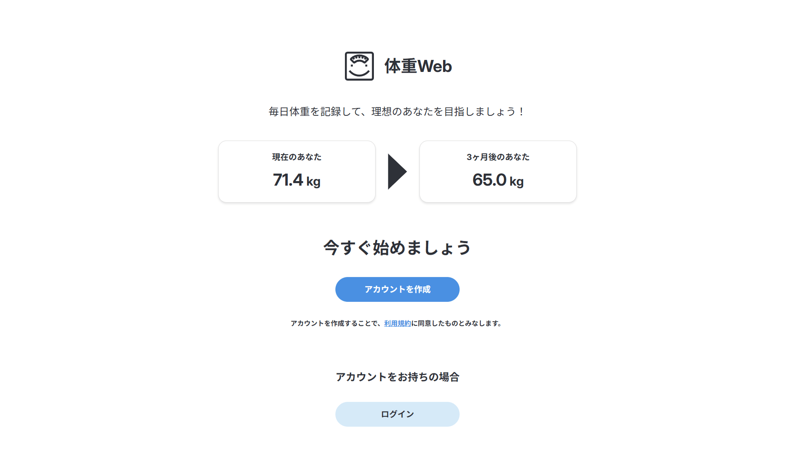

# 体重 Web

「体重 Web」は、体重の記録・グラフ表示・目標体重の管理ができる Web アプリです。  
メールアドレス登録不要で、10 桁の ID を使って複数デバイスでログインが可能です。

---

## 開発の目的

体組成計を使って日々の体重を測っていますが、スマホアプリを開いて測定しないと記録ができない点に不便さを感じていました。  
もっとシンプルに、体重だけをどのデバイスからでも手軽に記録できる Web サービスが欲しかったため、自分で開発することにしました。

また、Web アプリがどのように動いているのかを理解するため、あえてフレームワークを使わず、素の PHP と JavaScript で構成・実装しています。

---

## 使用技術

### フロントエンド

- PHP / CSS / JavaScript（ページ表示・UI 構築）
- Vite（JS/CSS のビルド）
- Chart.js（体重グラフ表示）

### バックエンド

- PHP（ページ処理・ルーティング）
- MySQL（データベース設計・操作）

### インフラ・運用

- Heroku（ステージング・本番環境）
- Google Tag Manager / GA4（アクセス解析）

### 開発支援

- Git / GitHub（バージョン管理）
- Figma（デザイン設計）

---

## 主な機能

- 10 桁 ID によるログイン/ログアウト
- アカウント登録機能
- 日々の体重記録（kg）と一言メモの記録・編集・削除
- 日別の記録表示
- 1 週間から 1 年単位までの日別グラフ表示
- BMI・推定体脂肪率・目標体重との差を自動計算
- アカウント情報・パスワード編集
- お知らせ通知（モーダル&未読管理）
- OGP / SEO / 利用規約対応済み
- 複数端末間共有可能

---

## 工夫したポイント

- メールアドレスなどの個人情報を登録させず、かつセキュリティを確保するため、10 桁のランダム ID によるアカウント設計を採用
- JS/CSS のビルド・圧縮に Vite を導入し、ページやモーダルの表示速度を向上
- 本番環境でセッションが切れないよう、PHP のセッションを DB で管理
- 将来的な機能拡張を見据えて、ER 図ベースでデータベースを設計
- コードは読みやすさ・保守性を重視し、ディレクトリ構成と命名規則を整理
- ID が重要なログイン情報となるため、3 日に 1 度の ID 表示モーダルや、ヘッダーへの常時表示でユーザーに保存を促す設計
- レスポンシブ対応済み。iOS や Android の実機でも挙動を検証

---

## デプロイ URL

https://www.weight-web.site/

---

## ログイン用サンプルアカウント

ID: 6768507134  
Password: test

---

## スクリーンショット

※以下はすべて PC 版の画面です。スマホでもレスポンシブ対応済み。

### ログイン前ページ



### アカウント作成モーダル


### アカウント作成完了モーダル


### トップページ


### 体重記録モーダル


### 体重ログページ


### ユーザー情報ページ


### ヘルプページ


### 設定ページ


---

## 今後の改善予定

- モーダルの表示速度向上
- データのバックアップ機能
- ID を QR コードで確認できるようにする
- お問い合わせコンテンツの追加

---

## ローカル開発セットアップ

```bash
git clone https://github.com/marumaru-3/weight-web.git
cd weight-web

# .envファイルを自分で作成し、以下のような内容を記載してください。
# APP_ENV=local
# DB_HOST=localhost
# DB_PORT=8889
# DB_NAME=weightweb
# DB_USERNAME=develop_user
# DB_PASSWORD=developKaihatsu0310

# PHPの組み込みサーバーを使う場合（`public` をルートに指定）
php -S localhost:8888 -t public
```

または

- MAMP / XAMPP などを使っている場合は、`weight-web/public` をドキュメントルートに設定し、  
  ブラウザから `http://localhost:8888` にアクセスしてください。

---

## デプロイ・開発環境 切り替え手順（Vite + Heroku 運用）

### 本番 or ステージングにデプロイする場合

#### 1. バッチファイルでデプロイ（どちらかを実行）

```
.\scripts\deploy-stg.bat     # ステージング環境にデプロイ
.\scripts\deploy-prod.bat    # 本番環境にデプロイ
```

- Vite で生成された `public/assets/` 以下のファイルがコミット対象になります

---

### 開発環境に戻す場合（MAMP など）

#### 1. `.htaccess` の切り替え

- `.htaccess.public` の内容を `.htaccess` にコピペして上書き

※ `.htaccess.heroku-stg` も必要に応じて切り替えてください

---

## Vite のビルド方法（JavaScript / CSS）

体重 Web では、Vite を使用して`main.js`と`style.css`をビルドしています。
デザイン・機能を変更した際は、以下の手順でビルドを行ってください。

```bash
npm install      #初回のみ
npx vite build    # JS/CSSをビルド（出力先：public/assets/）
```

- ビルド後、`public/assets/`フォルダに出力されたファイルが PHP から読み込まれます
- Vite の開発用サーバー（`npm run dev`）は使用していません
